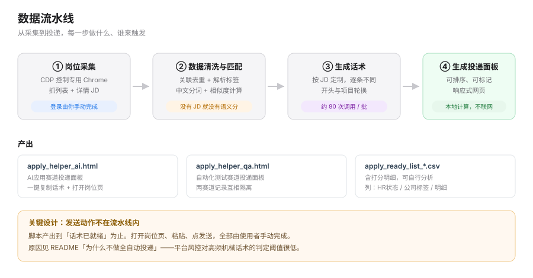
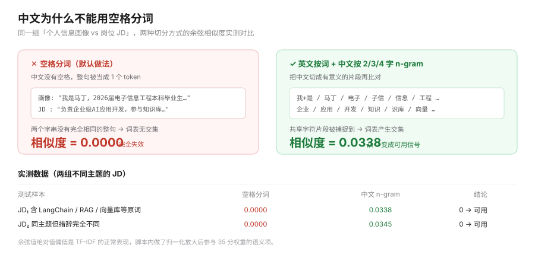
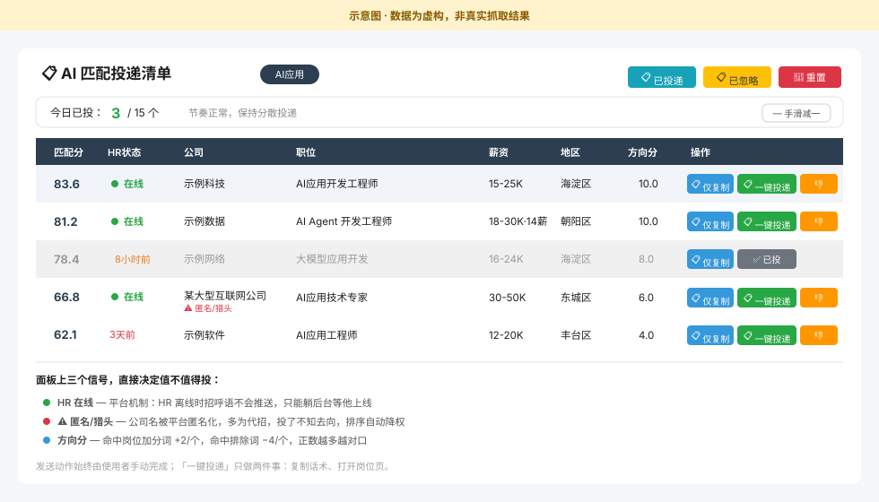

# AI 求职助手（BOSS直聘）

本地匹配排序 + 大模型生成差异化招呼语 + 手动投递面板。

> ⚠️ **本项目不自动投递、不模拟点击发送、不批量群发消息。**
> 脚本产出到「话术已就绪」为止，打开岗位页、粘贴、点发送全部由使用者手动完成。



---

## 这个项目解决什么问题

手动投递的流程是：在一堆岗位里翻 → 逐个判断自己和岗位搭不搭 → 复制一段差不多的招呼语 → 粘贴发送。岗位越多，越容易退化成「看标题顺眼就投」，招呼语也越来越像群发。

这个项目把可自动化的部分抽出来：

| 环节 | 谁来做 |
|---|---|
| 岗位采集（含 JD 正文） | 脚本，通过 CDP 控制已登录的浏览器 |
| 匹配打分、排序、分赛道 | 脚本，本地计算 |
| 生成差异化招呼语 | 脚本，调大模型 API |
| **打开岗位、粘贴、发送** | **使用者本人** |

产出是一个 HTML 面板：按匹配分排序、每条附一段针对该岗位 JD 生成的招呼语，点「一键投递」只做两件事——复制话术、打开岗位页。投递节奏、每日上限都靠人自己把握。

---

## 为什么不做全自动投递

这是刻意的设计取舍，不是没做完。

求职平台的账号风控对「短时间高频主动打招呼 + 机械重复话术 + 页面零停留」这组特征的判定阈值很低，一旦触发轻则功能限制、重则封号，且申诉成本极高。而求职者的账号本身就是最有价值的资产——**用主账号去赌一个自动发送脚本不被识别，风险收益比不成立**。

所以本项目只接管「筛选」和「准备」，把「发送」留给人。面板顶部带一个每日投递计数提示，帮助使用者把节奏控制在合理范围。

---

## 核心实现

### 1. 岗位采集

通过 Chrome DevTools Protocol 连接一个**专用 Chrome 实例**（独立 profile，不碰日常浏览器），抓取岗位列表与详情页 JD 正文。登录由使用者在浏览器里手动完成，脚本只复用这个已登录的会话。

列表数据和详情数据分别落在两个文件里：

```
boss_jobs_*.json     列表：标题/薪资/地区/公司/HR活跃状态
boss_details_*.json  详情：JD 正文、技能标签
```

### 2. 数据清洗与匹配

两个文件必须先在本地整合，才能进入打分环节：

- **关联**：按 `job_id` 把详情文件的 JD 正文并回列表数据
- **去重**：跨多次抓取按 `job_id` 去重，保留最新一条
- **解析**：从 `tags` 里拆出经验要求、学历要求；从 `salary` 解析薪资区间（兼容 `15-25K`、`元/月`、`元/天` 三种写法）
- **匹配**：对 JD 正文做中文分词与 TF-IDF 向量化，计算与个人画像的余弦相似度

> **关联这一步不做，语义匹配就拿不到 JD 正文**，35 分权重的语义项只能退回兜底分——项目早期版本正是踩了这个坑。

#### 关于中文分词

TF-IDF + 余弦相似度本身没问题，问题出在分词：`TfidfVectorizer` 默认按空格切词，而中文没有空格，**整句话会被当成一个 token**。结果是两段中文只要不是逐字相同，词表就没有交集，相似度恒为 0——等于整个匹配引擎是半瞎的。



解决办法是自定义 analyzer：英文按词切，中文按 2/3/4 字 n-gram 切（中文双字词占比高，n-gram 能捕捉到「向量」「检索」「知识库」这类有效片段，且不需要引入分词词典依赖）。

### 3. 打分排序

清洗后的数据进入八维加权打分（见下方[打分维度](#打分维度)），按赛道分池、组内排序。每条岗位输出可解释的明细，方便判断某一项为什么高或低：

```
技术栈30.0｜经验6.8｜学历10｜薪资10｜语义13.0｜方向10.0｜公司0｜活跃5.0
```

### 4. 生成话术

#### 4.1 判断为什么由代码做

早期把规则写进 prompt 交给模型判断，实测三类规则全部失效：

| 规则 | 写进 prompt 后的实测结果 | 改为代码控制的做法 |
|---|---|---|
| 开头要多样化 | 8 次生成全部固定用同一种开头（8/8 相同） | 轮换 4 种开头，prompt 只要求「原样照抄指定这句」 |
| JD 提到开源才附仓库链接 | 该附的不附，模型直接忽略 | 正则判断 JD 是否在索取作品集，命中才在结尾插入 |
| 讲哪段经历 | 默认永远讲同一段，一批 10 条话术正文完全一致 | 按 JD 关键词在项目间匹配，无命中则走默认项 |

**设计原则：凡属「按条件走分支」的判断，一律交给代码；模型只负责语言表达。**
目前开头选择、经历选择、链接触发、长度截断均由 Python 控制，行为可预测、可测试。

#### 4.2 话术内容：技术名前置

判断稳定之后，话术内容仍存在问题——一批 40 条中有约 20 条是这种写法：

> **改前**
> 我独立用 LangChain + Chroma + BGE Embedding 搭过一套 RAG **论文**问答系统，从文档切分到答案溯源完整跑通。

两处缺陷：

1. **「论文」暴露了项目是课程作业**——技术栈再对口，第一印象已经打折
2. **只讲实现过程，不讲产出价值**——对方读到的是一串技术名词，既没有可用于检索的关键词命中点，也无法判断这东西能解决什么业务问题

改法是调整叙述顺序：**技术名置于句首作为关键词，随后说明产出价值**。

> **改后**
> 我用 **LangChain** 把 PDF 等文档解析、切分、向量化后做语义检索，回答带原文出处，**能直接接进业务系统**；也常用 **Python** 处理数据、对接数据库。

对应到实现，每段经历增加两个字段：

| 字段 | 内容 | 作用 |
|---|---|---|
| `tools` | 技术名（如 `LangChain`、`Chroma`） | 作为关键词前置到句首 |
| `desc` | 产出与价值 | 说明做出来能干什么，而非怎么实现 |

#### 4.3 JD 技术词提取

`extract_jd_tech()` 从 JD 正文中提取该岗位真正在意的技术词，注入提示词以提示模型呼应。
词表共 77 个词，按「具体 → 泛化」排序，短英文词使用词边界匹配以避免误命中
（如 `Go` 不匹配 `Google`）。提取结果示例：

| 岗位类型 | 提取到的词 |
|---|---|
| AI 应用 | `Python`、`LangChain`、`向量数据库`、`RAG`、`智能体`、`MCP` |
| 测试 | `Jenkins`、`pytest`、`Selenium`、`JMeter`、`接口测试` |
| 数据分析 | `Python`、`SQL`、`Excel`、`Tableau`、`数据清洗` |
| 行政 | （空——词表中无匹配项，不强行填充） |

#### 4.4 约束边界

设计过程中出现过一次约束过度：为抑制「技能清单」写法，提示词中堆叠了三条语言风格禁令，
结果模型只能输出通用表述，话术反而更空泛。

最终的职责划分：

| 类型 | 控制方 | 覆盖内容 |
|---|---|---|
| 结构 | 代码 | 开头用哪句、讲哪段经历、长度上限、链接触发 |
| 事实 | 提示词硬规则 | 不编造经历、不写回复率数据、不出现网址 |
| 风格与内容 | 模型 | 选取哪个技术点、如何表述价值、语气用词 |

#### 4.5 提示词结构

每次生成组装一个 prompt，由四部分构成：

```
【求职者背景】  personal_summary 截断至 320 字
【目标岗位】    公司名 + 职位名 + JD 正文截断至 1500 字
【要求】        若干条规则，其中三条由 Python 预填变量
招呼语：        让模型续写正文
```

三个注入变量：

```python
opening   = _pick_opening(row)          # 轮换选定开头，prompt 只要求「原样照抄」
project   = _pick_project(row, profile) # 按 JD 关键词选定讲哪段经历
jd_tech   = extract_jd_tech(jd)         # 从 JD 提取技术词，提示模型呼应
```

对应的 prompt 片段：

```
1. 开头必须用下面指定的这一句，原样照抄，不要改写：
   「{opening}」
2. 讲下面这个指定经历，不要换成背景里别的经历：
   可选技术名：{project.tools}
   做出来能干嘛：{project.desc}
   要求：从「可选技术名」里挑 1 个念出来就够，不要三个都念
3. 从岗位描述里挑 1-2 个最具体的技术点来呼应
   （这个岗位明确提到了：{jd_tech}），只挑 1-2 个，不要全念一遍
```

两处经实测调整的细节：

- **第 2 条最初写作「把技术名念出来」，模型将三个技术名全部写入，又退回技能清单写法**；
  收紧为「挑 1 个」后才达到预期效果。
- **画像摘要截断至 320 字**：完整传入 4 个项目时，模型会把它们全部写进话术，
  导致输出超长（实测 96~115 字，而要求为 100 字以内）；缩短输入素材后输出自然收敛。
  即**输出长度问题无法通过调整字数限制解决，需要改输入**。

#### 4.6 长度兜底

模型不遵守提示词中的字数限制（实测仍会写到 115 字），因此由代码兜底至 110 字。
直接截断会产生「…能直接。」这类残句，实现上先为收尾句「期待有机会进一步沟通。」
预留预算，再按句末回退截取正文，保证输出不出现半句话。

### 5. 投递面板



> 上图为示意图，数据为虚构，非真实抓取结果。

面板上三个信号直接决定值不值得投：

- **HR 状态** — 平台机制下 HR 离线时招呼语不会推送到对方设备，只能躺后台等他上线，所以「在线」的岗位优先
- **公司标签** — 公司名被平台匿名化（如「某大型互联网公司」）的多为猎头或代招，投了不知去向，排序自动降权
- **方向分** — 命中岗位加分词 +2/个，命中排除词 −4/个

两条赛道各自生成一份面板，localStorage 记录相互隔离（`appliedJobs_ai` / `appliedJobs_qa`），可以在同一浏览器里并行使用。

---

## 快速开始

### 1. 安装依赖

```bash
pip install pandas scikit-learn requests python-dotenv
```

### 2. 配置密钥

复制 `.env.example` 为 `.env`：

```
DEEPSEEK_API_KEY=sk-your-api-key-here
DEEPSEEK_MODEL=deepseek-chat
```

> `.env` 已在 `.gitignore` 中。**不要把密钥写死在代码里。**
> 不配置也能运行，会自动降级为模板话术（但模板重复度高，不建议用于实际投递）。
>
> ⚠️ 脚本已显式设置 `proxies={'http': None, 'https': None}`：DeepSeek 为国内服务，
> 若经系统代理被绕到境外出口，会因 SSL 握手中断导致**全部调用失败并静默降级到模板**。

### 3. 采集岗位数据

本项目依赖 [`boss-zhipin-scraper`](../boss-zhipin-scraper-master) 抓取岗位列表与详情，
默认输出到 `~/.boss-zhipin-scraper/job-result/`：

```bash
python scripts/boss_cdp_raw.py --keyword "AI应用" --city 北京 --pages 2 --detail
```

- `--pages` 建议 **2**：详情页每抓一个要间隔 10~25 秒，页数调大容易触发平台登录墙
- `--detail` 必须加，否则没有 JD 正文
- 中途撞登录墙时脚本会在写入前中断，已抓到的部分会保留；重新登录后可用 `--merge` 接着补

### 4. 生成投递清单

```bash
python AI投递boss简历_v2.py
```

输出：

- `apply_helper_ai.html` / `apply_helper_qa.html` —— **双击用浏览器打开即可投递**
- `apply_ready_list_ai.csv` / `apply_ready_list_qa.csv` —— 含打分明细的底表

---

## 打分维度

| 维度 | 权重 | 说明 |
|---|---|---|
| 技术栈 | 30 | 岗位技能标签与画像技术栈的交集；无标签时从 JD 正文命中关键词 |
| 语义 | 35 | JD 正文与个人画像的中文 TF-IDF 余弦相似度 |
| 经验 | 15 | 解析「经验不限 / 1-3年」等标签，超出经验要求越多扣得越狠 |
| 学历 | 10 | 低于岗位要求直接归零 |
| 薪资 | 10 | 与期望薪资的比值 |
| 方向 | ±10 | 加分词 +2/个，排除词 −4/个 |
| 公司 | −8 / −5 | 匿名化公司名 −8，人力资源/外包/代招类 −5 |
| 活跃 | +5 ~ −4 | HR 在线 +5，12 小时内 +2，超过 12 小时 −1，N 天前 −4 |

标题命中硬件/车载/智驾等不匹配方向的岗位会被**直接剔除**，不进入面板：

```
车载 | 整车 | 电机 | 电池 | BMS | 嵌入式 | 单片机 | 硬件测试 | 射频 | 天线 |
算法测试 | 外场测试 | EMC | 结构测试 | 可靠性测试 | 智驾 | 行车测试 | 辅助驾驶 | 自动驾驶
```

---

## 项目结构

```
AI投递boss简历_v2.py     主脚本：双赛道版（推荐使用）
AI投递boss简历.py        初版，单赛道，保留作对照
AI投递猎聘简历.py        猎聘模块，见「已知限制」
.env.example            密钥模板
docs/                   README 用示意图（SVG）
```

主脚本内部分层：

| 函数 | 职责 |
|---|---|
| `classify_track()` | 判断岗位属于 AI应用 / 自动化测试 / 不关心 |
| `build_dataframe()` | 加载列表与详情、按 `job_id` 合并去重 |
| `_zh_analyzer()` / `semantic_score()` | 中文分词与语义打分 |
| `company_credibility()` / `hr_activity()` | 公司可信度、HR 活跃度 |
| `score_row()` | 八维加权打分，返回明细 |
| `_pick_opening()` / `_pick_project()` | 招呼语开头与主打项目的轮换选择 |
| `jd_wants_oss()` / `_attach_oss()` / `_cap_length()` | 链接触发、长度兜底 |
| `generate_greeting()` | 组装 prompt、调模型、降级兜底 |
| `build_html()` | 生成投递面板 |

---

## 配置项速查

改行为只需改脚本顶部的常量：

| 常量 | 默认 | 作用 |
|---|---|---|
| `LOOKBACK_DAYS` | 14 | 只合并最近 N 天的抓取数据 |
| `DAILY_CAP` | 15 | 面板上的每日投递建议上限（仅提示） |
| `GREETING_LIMIT` | 40 | 每条赛道生成多少条话术 |
| `MAX_GREETING_LEN` | 110 | 话术硬上限，超出回退到最后一个句末 |
| `OSS_URL` | 本仓库地址 | JD 索取代码时附上的链接 |
| `DEFAULT_PROJECT` | AI→智能求职助手 / QA→金融终端自动化导出系统 | 关键词无命中时讲哪段经历 |
| `_TECH_VOCAB` | 80+ 词 | JD 技术词提取用的词表，按「具体→泛化」排序 |
| `_PROJECTS` | — | 每段经历的 `tools`（技术名）/ `desc`（价值）/ `keys`（命中词） |
| `PROFILE_AI` / `PROFILE_QA` | — | 两条赛道的技能栈、薪资、加分/排除词 |

---

## 已知限制

**猎聘模块的采集端尚未接入本仓库。** 采集用的是同目录外的 `liepin_cdp.py`
（放在 `boss-zhipin-scraper/scripts/` 下，与 BOSS 采集器同处），投递脚本
`AI投递猎聘简历.py` 只读它产出的 JSON。

猎聘与 BOSS 的两个关键差异（改猎聘代码前务必先看）：

| | BOSS | 猎聘 |
|---|---|---|
| 认证方式 | CDP，复用已登录会话 | 同样 CDP，但**同一 Chrome 需要单独登录一次 liepin.com** |
| 城市参数 | `--city 北京` | 必须用 `dq=010`，用 `city=010` 只有 5/42 是北京 |
| 招聘类型 | 无此维度 | 必须加 `jobKind=1`，否则 42 条里只有 2 条社招，其余是实习/应届 |

另外猎聘的 `jobCard` 有**两套字段结构**：社招岗用 `job.requireWorkYears`，
校招/实习岗改用 `job.labels`（如 `["3个月","本科"]`）并带 `campusJobKind` 标记。
只读前者会让所有校招岗的经验学历变成空字符串。

**猎聘上「AI应用」这类技术方向关键词的搜索结果以校招/实习为主**——实测三页
125 条里校招类占 119 条。改用 `jobKind=1` 后能拿到社招列表，但社招岗普遍要求
3 年以上经验，应届可投的比例不高，且匿名化公司名（「某北京知名公司」）占比明显。

旧的 cookie 模式采集器 `liepin_api.py` + `liepin_config.json` 仍保留在
`boss-zhipin-scraper/scripts/`，但需要手动从浏览器抓包复制 cookie / xsrf_token /
ckId / skId / fkId 五个字段，已不推荐使用。

---

## 合规声明

- 本工具仅用于个人求职，采集的是登录后可正常访问的公开岗位信息
- 请遵守目标平台的用户协议与 robots 规则，控制请求频率
- 请勿用于批量投递、骚扰招聘方或任何商业化数据采集
- 使用本工具产生的任何后果由使用者自行承担

## License

MIT

---

由 [mading007](https://github.com/mading007) 开发维护。
